<!--
Copyright 2024 Google LLC

Licensed under the Apache License, Version 2.0 (the "License");
you may not use this file except in compliance with the License.
You may obtain a copy of the License at

      https://www.apache.org/licenses/LICENSE-2.0

Unless required by applicable law or agreed to in writing, software
distributed under the License is distributed on an "AS IS" BASIS,
WITHOUT WARRANTIES OR CONDITIONS OF ANY KIND, either express or implied.
See the License for the specific language governing permissions and
limitations under the License.
-->
 

# ViGenAiR - Recrafting Video Ads with Generative AI

**Disclaimer: This is not an official Google product.**

[Overview](#overview) •
[Get started](#get-started) •
[What it solves](#why-use-vigenair) •
[How it works](#how-vigenair-works) •
[How to Contribute](#how-to-contribute)

## Updates

Update to the latest version by running `npm run update-app` after pulling the latest changes from the repository via `git pull --rebase --autostash`; you would need to redploy the *UI* for features marked as `frontend`, and *GCP components* for features marked as `backend`.

* [March 2025]
  * `frontend` + `backend`: Added functionality to cut segments by adding *split markers* and re-running the extraction process. Read more [here](#22-segment-splitting).
* [February 2025]
  * `frontend`: You can now choose objective-specific ABCDs (Awareness, Consideration, Action, or Shorts) in the *Advanced settings* section of variants generation. Read more [here](#41-variants-generation).
* [January 2025] Happy New Year!
  * `frontend`: You can now input your own guidelines for evaluation and scoring of generated variants using the *Advanced settings* section. Read more [here](#41-variants-generation).
  * `backend`: Added functionality to identify key frames using Gemini and extract them as additional Demand Gen image assets.
  * `backend`: Improved the extraction process to maintain consistency across the generated descriptions and keywords per segment.
* [December 2024]
  * `frontend`: Added functionality to generate Demand Gen text assets in a desired target language. Read more [here](#6-output-videos).
  * `frontend`: Added possibility to load previously rendered videos via a new dropdown. You can now also specify a name for each render job which will be displayed alongside the render timestamp. Read more [here](#43-loading-previously-rendered-videos).
  * `frontend`: Added checkbox to select/deselect all segments during variants preview.
  * `frontend`: During variants generation, users can now preview the total duration of their variant directly as they are selecting/deselecting segments.
  * `frontend`: The ABCDs evaluation section per variant may now additionally include recommendations on how to improve the video's content to make it more engaging.
  * `frontend`: Improved user instruction following for the variants generation prompt and simplified the input process; you no longer need a separate checkbox to include or exclude elements - just specify your requirements directly in the prompt.
  * `frontend` + `backend`: Added support for Gemini 2.0.
* [November 2024]
  * `frontend` + `backend`: General bug fixes and performance improvements.
  * `frontend` + `backend`: Added possibility to select the timing for audio and music overlays. Read more [here](#42-user-controls-for-video-rendering).
* [October 2024]
  * `frontend` + `backend`: Added functionality to "fade out" audio at the end of generated videos. Read more [here](#42-user-controls-for-video-rendering).
  * `frontend`: Added functionality to regenerate Demand Gen text assets. Read more [here](#6-output-videos).
* [September 2024]
  * `backend`: You can now process any video of any length or size - even beyond the Google Cloud Video Intelligence API [limits](https://cloud.google.com/video-intelligence/quotas) of 50 GB size and up to 3h video length.
* [August 2024]
  * Updated the [pricing](#pricing-and-quotas) section and Cloud calculator example to use the new (cheaper) pricing for `Gemini 1.5 Flash`.
  * `frontend`: You can now manually move the Smart Framing crop area to better capture the point of interest. Read more [here](#3-object-tracking-and-smart-framing).
  * `frontend`: You can now share a page of the Web App containing your rendered videos and all associated image & text assets via a dedicated link. Read more [here](#6-output-videos).
  * `frontend` + `backend`: Performance improvements for processing videos that are 10 minutes or longer.
* [July 2024]
  * `frontend` + `backend`: We now render non-blurred vertical and square formats by dynamically framing the most prominent part of the video. Read more [here](#3-object-tracking-and-smart-framing).
  * `frontend` + `backend`: You can now reorder segments by dragging & dropping them during the variants preview. Read more [here](#42-user-controls-for-video-rendering).
  * `frontend` + `backend`: The UI now supports upload and processing of all video MIME types [supported by Gemini](https://cloud.google.com/vertex-ai/generative-ai/docs/multimodal/video-understanding#video_requirements).
  * `backend`: The Demand Gen text assets generation prompt has been adjusted to better adhere to the ["Punctuation & Symbols" policy](https://support.google.com/adspolicy/answer/14847994).
* [June 2024]
  * `frontend`: Enhanced file upload process to support >20MB files and up to browser-specific limits (~2-4GB).
  * `frontend` + `backend`: Improved variants generation and Demand Gen text assets generation prompt.
* [May 2024]: Launch! 🚀

## Overview

**ViGenAiR** *(pronounced vision-air)* harnesses the power of multimodal Generative AI models on Google Cloud Platform (GCP) to automatically transform long-form Video Ads into shorter variants, in multiple ad formats, targeting different audiences. It is your AI-powered creative partner, generating video, image and text assets to power [Demand Gen](https://support.google.com/google-ads/answer/13695777?hl=en) and [YouTube video campaigns](https://support.google.com/youtube/answer/2375497?hl=en). ViGenAiR is an acronym for **Vi**deo **Gen**eration via **A**ds **R**ecrafting, and is more colloquially referred to as *Vigenair*. Check out the tool's sizzle reel on YouTube by clicking on the image below:

> Note: **Looking to take action on your Demand Gen insights and recommendations?** Try [Demand Gen Pulse](https://github.com/google-marketing-solutions/dgpulse), a Looker Studio Dashboard that gives you a single source of truth for your Demand Gen campaigns across accounts. It surfaces creative best practices and flags when they are not adopted, and provides additional insights including audience performance and conversion health.

## Get Started

Please make sure you have fulfilled all prerequisites mentioned under [Requirements](#requirements) first.

1. Make sure your system has an up-to-date installation of [Node.js and npm](https://docs.npmjs.com/downloading-and-installing-node-js-and-npm).
1. Install [clasp](https://github.com/google/clasp) by running `npm install @google/clasp@2.4.2 -g`, then login via `clasp login`.
1. Navigate to the [Apps Script Settings page](https://script.google.com/home/usersettings) and `enable` the Apps Script API.
1. Make sure your system has an up-to-date installation of the [gcloud CLI](https://cloud.google.com/sdk/docs/install), then login via `gcloud auth login`.
1. Make sure your system has an up-to-date installation of `git` and use it to clone this repository:
   `git clone https://github.com/google-marketing-solutions/vigenair`.
1. Navigate to the directory where the source code lives: `cd vigenair`.
1. Run `npm start`:
    * First, enter your GCP Project ID.
    * Then select whether you would like to deploy GCP components (defaults to `Yes`) and the UI (also defaults to `Yes`).
        * When deploying GCP components, you will be prompted to enter an optional [Cloud Function region](https://cloud.google.com/functions/docs/locations) (defaults to `us-central1`) and an optional [GCS location](https://cloud.google.com/storage/docs/locations) (defaults to `us`).
        * When deploying the UI, you will be asked if you are a Google Workspace user and if you want others in your Workspace domain to access your deployed web app (defaults to `No`). By default, the web app is only accessible by you, and that is controlled by the [web app access settings](https://developers.google.com/apps-script/manifest/web-app-api-executable#webapp) in the project's [manifest file](./ui/appsscript.json), which defaults to `MYSELF`. If you answer `Yes` here, this value will be changed to `DOMAIN` to allow other individuals within your organisation to access the web app without having to deploy it themselves.

The `npm start` script will then proceed to perform the deployments you requested (GCP, UI, or both), where GCP is deployed first, followed by the UI. For GCP, the script will first create a bucket named <code>*<gcp_project_id>*-vigenair</code> (if it doesn't already exist), then enable all necessary Cloud APIs and set up the right access roles, before finally deploying the `vigenair` Cloud Function to your Cloud project. The script would then deploy the Angular UI web app to a new Apps Script project, outputting the URL of the web app at the end of the deployment process, which you can use to run the app.

See [How Vigenair Works](#how-vigenair-works) for more details on the different components of the solution.

> Note: If using a completely new GCP project with no prior deployments of Cloud Run / Cloud Functions, you may receive [Eventarc permission denied errors](https://cloud.google.com/eventarc/docs/troubleshooting#trigger-error) when deploying the `vigenair` Cloud Function for the very first time. Please wait a few minutes ([up to seven](https://cloud.google.com/iam/docs/access-change-propagation)) for all necessary permissions to propagate before retrying the `npm start` command.
>> Additional note: You may also use Terraform to deploy the Vigenair backend. This can be done by setting the `USE_TERRAFORM_FOR_GCP_DEPLOYMENT` constant in [common.ts](common.ts) to `true` and ensuring that [Terraform is installed](https://developer.hashicorp.com/terraform/tutorials/gcp-get-started/install-cli) before running the `npm start` command.

### Managing Apps Script Deployments

The `npm start` and `npm run update-app` scripts manage deployments for you; a new deployment is always created and existing ones get archived, so that the version of the web app you use has the latest changes from your local copy of this repository. If you would like to manually manage deployments, you may do so by navigating to the [Apps Script home page](https://script.google.com), locating and selecting the `ViGenAiR` project, then managing deployments via the *Deploy* button/dropdown in the top-right corner of the page.

### Requirements

You need the following to use Vigenair:

* Google account: required to access the Vigenair web app.
* GCP project
  * All users running Vigenair must be granted the [Vertex AI User](https://cloud.google.com/vertex-ai/docs/general/access-control#aiplatform.user) and the [Storage Object User](https://cloud.google.com/storage/docs/access-control/iam-roles) roles on the associated GCP project.

The Vigenair [setup and deployment script](#get-started) will create the following components:

* A Google Cloud Storage (GCS) bucket named <code>*<gcp_project_id>*-vigenair</code>
* A Cloud Function (2nd gen) named `vigenair` that fulfills both the [Extractor and Combiner services](#solution-details). Refer to [deploy.sh](./service/deploy.sh) for specs.
* An Apps Script deployment for the frontend web app.

If you will also be deploying Vigenair, you need to have the following additional roles on the associated GCP project:

* `Storage Admin` for the entire project OR `Storage Legacy Bucket Writer` on the <code>*<gcp_project_id>*-vigenair</code> bucket. See [IAM Roles for Cloud Storage](https://cloud.google.com/storage/docs/access-control/iam-roles) for more information.
* `Cloud Functions Developer` to deploy and manage Cloud Functions. See [IAM Roles for Cloud Functions](https://cloud.google.com/functions/docs/reference/iam/roles) for more information.
* `Project IAM Admin` to be able to run the commands that set up roles and policy bindings in the deployment script. See [IAM access control](https://cloud.google.com/resource-manager/docs/access-control-proj) for more information.

## Why use Vigenair?

Current Video Ads creative solutions, both within YouTube / Google Ads as well as open source, primarily focus on 4 of the [5 keys to effective advertising](https://info.ncsolutions.com/hubfs/2023%20Five%20Keys%20to%20Advertising%20Effectiveness/NCS_Five_Keys_to_Advertising_Effectiveness_E-Book_08-23.pdf) - Brand, Targeting, Reach and Recency. Those 4 pillars contribute to *only ~50%* of the potential marketing ROI, with the 5th pillar - **Creative** - capturing a *whopping ~50%* all on its own.

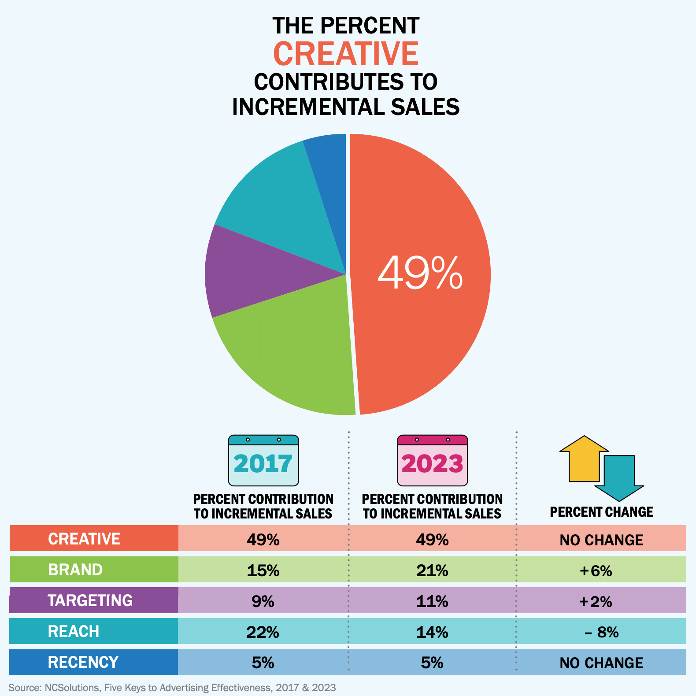

Vigenair focuses on the *Creative* pillar to help potentially **unlock ~50% ROI** while solving a huge pain point for most advertisers; the generation of high-quality video assets in different durations and Video Ad formats, powered by Google's multimodal Generative AI - Gemini.

### Benefits

* **Inventory**: Horizontal, vertical and square Video assets in different durations allow advertisers to tap into virtually ALL Google-owned sources of inventory.
* **Campaigns**: Shorter more compelling Video Ads that still capture the meaning and storyline of their original ads - ideal for *Social* and *Awareness/Consideration* campaigns.
* **Creative Excellence**: Coherent Videos (e.g. dialogue doesn't get cut mid-scene, videos don't end abruptly, etc.) that follow Google's [best practices for effective video ads](https://www.youtube.com/ads/abcds-of-effective-video-ads/), including dynamic square and vertical aspect ratio framing,  and (coming soon) creative direction rules for camera angles and scene cutting.
* **User Control**: Users can steer the model towards generating their desired videos (via prompts and/or manual scene selection).
* **Performance**: Built-in A/B testing provides a basis for automatically identifying the best variants tailored to the advertiser's target audiences.

## How Vigenair works

Vigenair's frontend is an Angular Progressive Web App (PWA) hosted on Google Apps Script and accessible via a [web app deployment](https://developers.google.com/apps-script/guides/web). Users must authenticate with a Google account in order to use the Vigenair web app. Backend services are hosted on [Cloud Functions 2nd gen](https://cloud.google.com/functions/docs/concepts/version-comparison), and are triggered via Cloud Storage (GCS). Decoupling the UI and core services via GCS significantly reduces authentication overhead and effectively implements separation of concerns between the frontend and backend layers.

Vigenair uses Gemini on Vertex AI to *holistically* understand and analyse the content and storyline of a Video Ad, **automatically** splitting it into *coherent* audio/video segments that are then used to generate different shorter variants and Ad formats. Vigenair analyses the spoken dialogue in a video (if present), the visually changing shots, on-screen entities such as any identified logos and/or text, and background music and effects. It then uses all of this information to combine sections of the video together that are *coherent*; segments that won't be cut mid-dialogue nor mid-scene, and that are semantically and contextually related to one another. These coherent A/V segments serve as the building blocks for both GenAI and user-driven recombination.

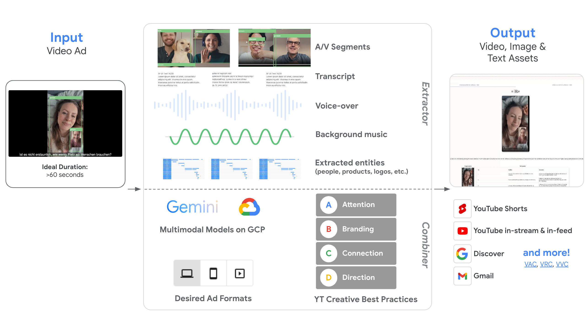

The generated variants may follow the original Ad's storyline - and thus serve as *mid-funnel reminder campaigns* of the original Ad for **Awareness and/or Consideration** - or introduce whole new storylines altogether, all while following Google's [best practices for effective video ads](https://www.youtube.com/ads/abcds-of-effective-video-ads/).

### Limitations

* Vigenair will not work *well* for all types of videos. Try it out with an open mind :)
* Users cannot delete previously analysed videos via the UI; they must do this directly in GCS.
* The current audio analysis and understanding tech is unable to differentiate between voice-over and any singing voices in the video. The *Analyse voice-over* checkbox in the UI's *Video selection* card can be used to counteract this; uncheck the checkbox for videos where there is no voice-over, rather just background song and/or effects.
* When generating video variants, segments selected by the LLM might not follow user prompt instructions, and the overall variant might not follow the desired target duration. It is recommended to review and potentially modify the preselected segments of the variant before adding it to the *render queue*.
* When previewing generated video variants, audio overlay settings are not applied; they are only available for fully rendered variants.
* Resizing text overlays / supers when cropping videos into vertical and square formats is currently not supported.

### Solution Details

The diagram below shows how Vigenair's components interact and communicate with one another.

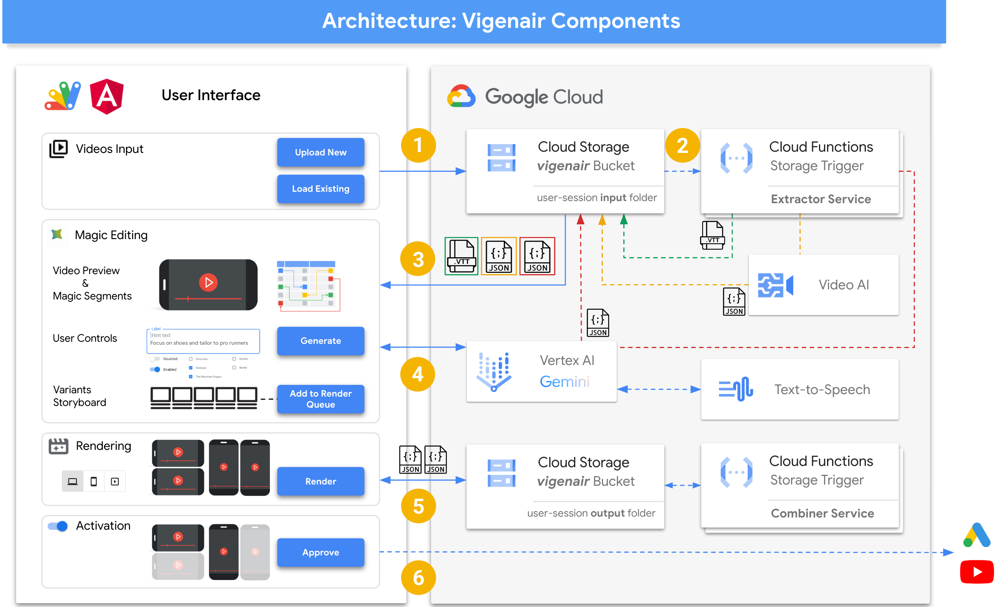

#### 1. Video Selection

Users upload or select videos they have previously analysed via the UI's `Video selection` card ([step #2](#21-video-processing-and-extraction) is skipped for already analysed videos).

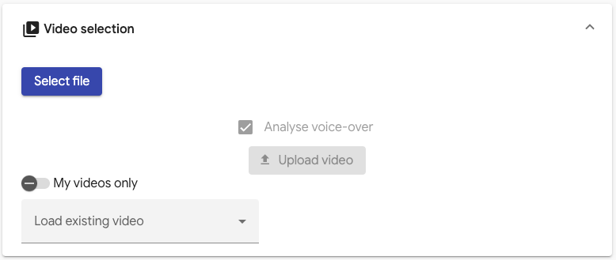

* The *Load existing video* dropdown pulls all processed videos from the associated GCS bucket when the page loads, and updates the list whenever users interact with the dropdown.
* The *My videos only* toggle filters the list to only those videos uploaded by the current user - this is particularly relevant for Google Workspace users, where the associated GCP project and GCS bucket are shared among users within the same organisation.
* The *Analyse voice-over* checkbox, which is checked by default, can be used to skip the process of transcribing and analysing any voice-over or speech in the video. **Uncheck** this checkbox for videos where there is only background music / song or effects.
* Uploads get stored in GCS in separate folders following this format: `<input_video_filename>(--n)--<timestamp>--<encoded_user_id>`.
  * `input_video_filename`: The name of the video file as it was stored on the user's file system.
  * Optional `--n` suffix to the filename: For those videos where the *Analyse voice-over* checkbox was **unchecked**.
  * `timestamp`: Current timestamp in **microseconds** (e.g. 1234567890123)
  * `encoded_user_id`: Base64 encoded version of the [user's email](https://developers.google.com/apps-script/reference/base/user#getemail) - if available - otherwise Apps Script's [temp User ID](https://developers.google.com/apps-script/reference/base/session#gettemporaryactiveuserkey).

#### 2.1. Video Processing and Extraction

New uploads into GCS trigger the Extractor service Cloud Function, which extracts all video information and stores the results on GCS (`input.vtt`, `analysis.json` and `data.json`).

* First, background music and voice-over (if available) are separated via the [spleeter](https://github.com/deezer/spleeter) library, and the voice-over is transcribed.
* Transcription is done via the [faster-whisper](https://github.com/SYSTRAN/faster-whisper) library and the output is stored in an `input.vtt` file, along with a `language.txt` file containing the video's primary language, in the same folder as the input video.
* Video analysis is done via the Cloud [Video Intelligence API](https://cloud.google.com/video-intelligence), where visual shots, detected objects - with tracking, labels, people and faces, and recognised logos and any on-screen text within the input video are extracted. The output is stored in an `analysis.json` file in the same folder as the input video.
* Finally, *coherent* audio/video segments are created using the transcription and video intelligence outputs and then cut into individual video files and stored on GCS in an `av_segments_cuts` subfolder under the root video folder. These cuts are then annotated via Gemini, which provides a description and a set of associated keywords / topics per segment. The fully annotated segments (including all information from the Video Intelligence API) are then compiled into a `data.json` file that is stored in the same folder as the input video.
* A/V segments are displayed in two ways:
  * In the *video preview* view: A single frame of each segment, cut mid-segment, is displayed in a filmstrip and scrolls into view while the user is previewing the video, indicating the segment that is *currently playing*. Clicking on a segment will also automatically seek to it in the video preview.

    
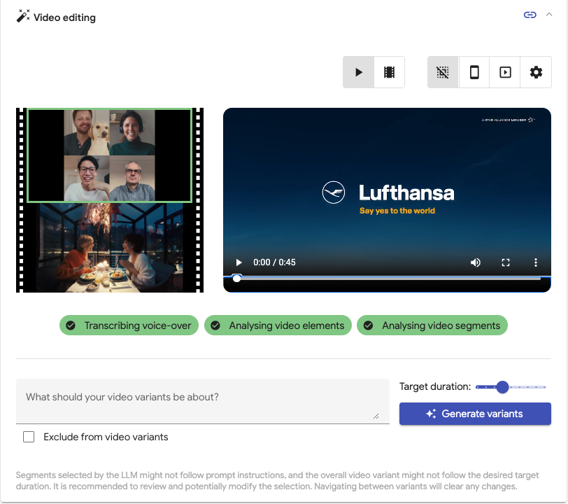

  * A detailed *segments list* view: Which shows additional information per segment; the segment's duration, description and extracted keywords, along with a video preview of the segment.

    
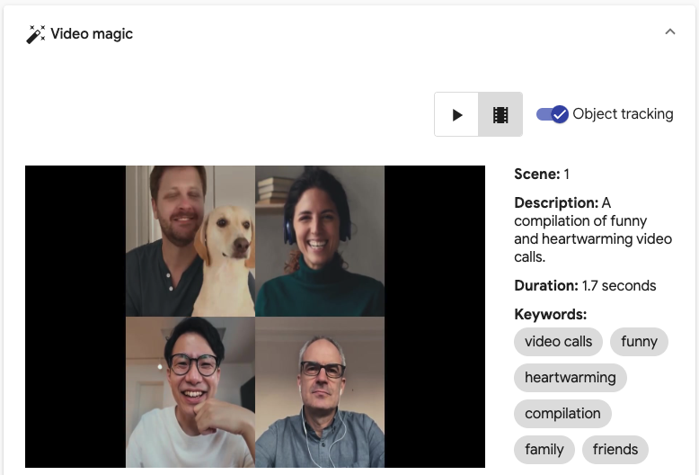

#### 2.2. Segment Splitting

For some videos, the Video Intelligence API is not able to extract the individual shots that make up the video, or the spoken audio overlaps individual visual segments - which is very common in product explainer videos - and so users end up with long segments that make shortening largely infeasible.

To solve this, users can add **split markers** to individual segments in the *segments list* view by first pausing the associated video preview and seeking to the desired point in the video via the media player controls.

Once ready, clicking on *Split segment* will upload a <code>\<timestamp\>_split.json</code> file to GCS, which will trigger the `vigenair` Cloud Function to split the segment and adjust the `data.json` file accordingly. The UI will display a loading spinner until the segment split operation is complete.

#### 3. Object Tracking and Smart Framing

The UI continuously queries GCS for updates while showing a preview of the uploaded video.

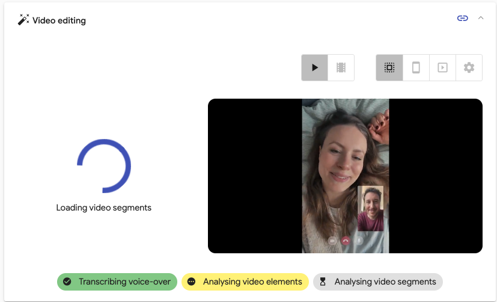

* Once the `input.vtt` is available, a transcription track is embedded onto the video preview.
* Once the `analysis.json` is available, [object tracking](https://cloud.google.com/video-intelligence/docs/object-tracking) results are displayed as bounding boxes directly on the video preview. These can be toggled on/off via the first button in the top-left toggle group - which is set to *on* by default.
* Vertical and square format previews are also generated, and can be displayed via the second and third buttons of the toggle group, respectively. The previews are generated by dynamically moving the vertical/square crop area to capture the most prominent element in each frame.

  
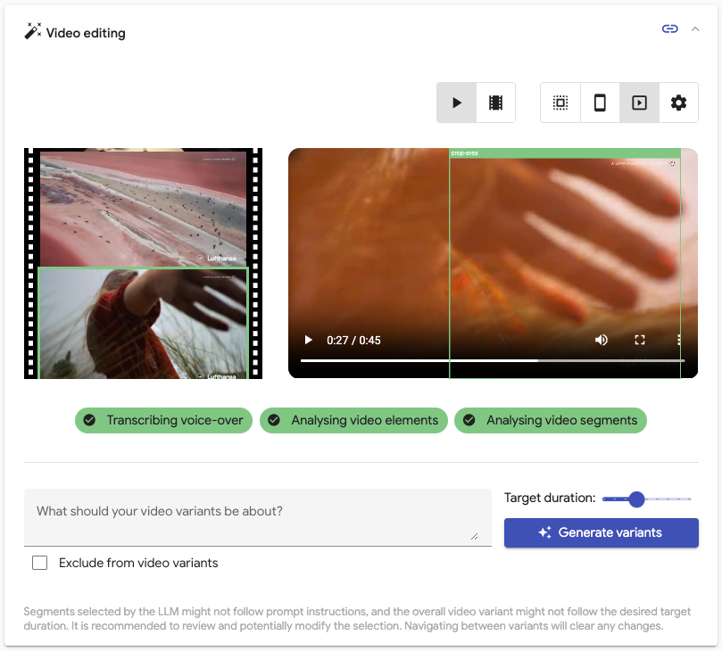

* Smart framing is controlled via weights that can be modified via the fourth button of the toggle group to increase or decrease the prominence score of each element, and therefore skew the crop area towards it. You can regenerate the crop area previews via the button in the settings dialog as shown below.

  
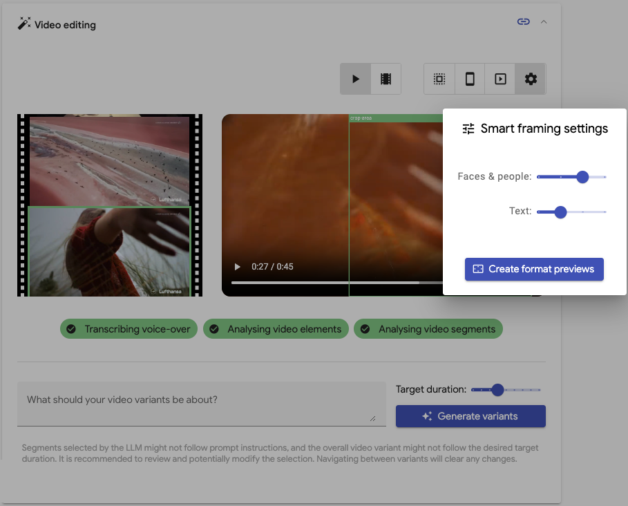

* You can also manually move the crop area in case the smart framing weights were insufficient in capturing your desired point of interest. This is possible by doing the following:
  * Select the desired format (square / vertical) from the toggle group and play the video.
  * Pause the video at the point where you would like to manually move the crop area.
  * Click on the "Move crop area" button that will appear above the video once paused.
  * Drag the crop area left or right as desired.
  * Save the new position of the crop area by clicking on the "Save adjusted crop area" button.

    

The crop area will be adjusted automatically for all preceding and subsequent video frames that had the same undesired position.

* Once the `data.json` is available, the extracted A/V Segments are displayed along with a set of user controls.
* Clicking on the link icon in the top-right corner of the "Video editing" panel will open the Cloud Storage browser UI and navigate to the associated video folder.

  
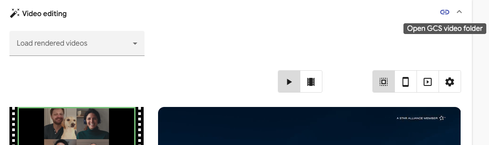

#### 4.1. Variants Generation

Users are now ready for combination. They can view the A/V segments and generate / iterate on variants via a *preview* while modifying user controls, adding desired variants to the render queue.

* User Controls for video variant generation:

    
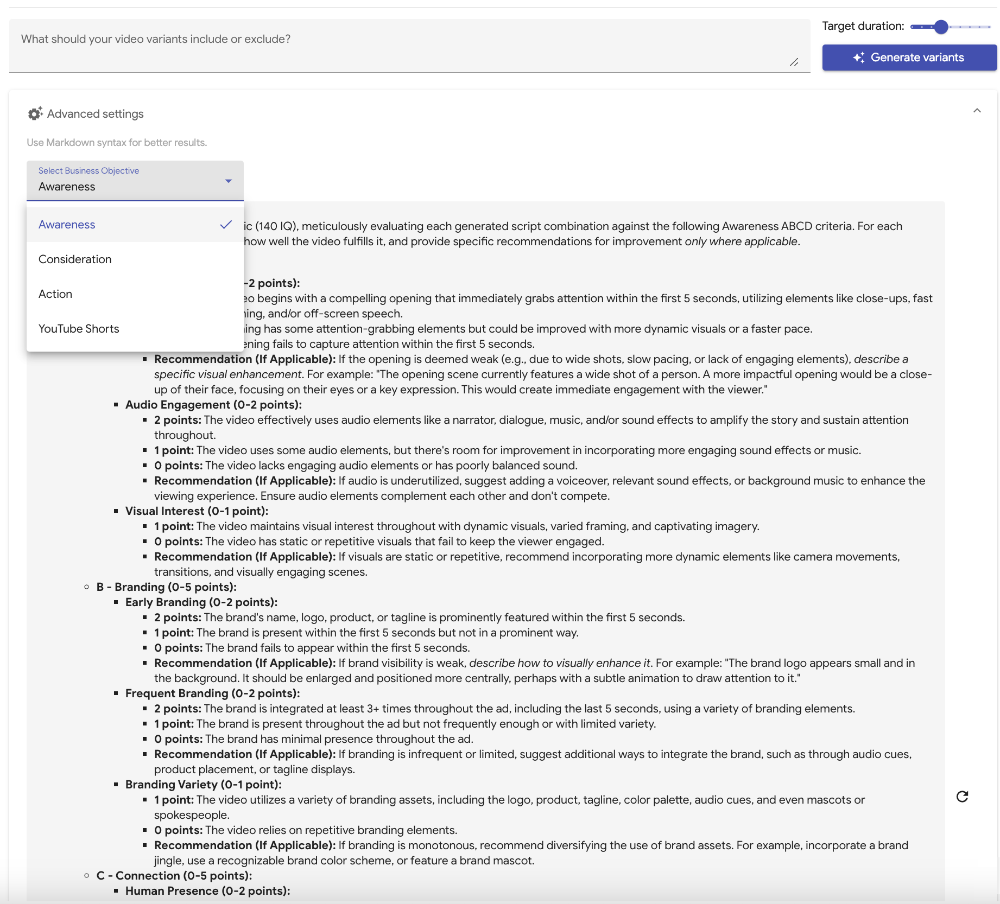

  * Users are presented with an optional prompt which they can use to steer the output towards focusing on - or excluding - certain aspects, like certain entities or topics in the input video, or target audience of the resulting video variant.
  * Users may also use the *Target duration* slider to set their desired target duration.
  * The expandable *Advanced settings* section (collapsed by default) contains a dropdown to choose the [YouTube ABCDs](https://www.youtube.com/ads/abcds-of-effective-video-ads/) evaluation objective (Awareness, Consideration, Action, or Shorts), along with an additional **Evaluation prompt** prompt that users can optionally modify. This prompt contains the criteria upon which the generated variant should be evaluated, which defaults to the *Awareness* ABCDs. Users can input details about their own brand and creative guidelines here, either alongside or instead of the ABCDs, and may click the *reset* button next to the prompt to reset the input back to the default ABCDs value. We recommend using Markdown syntax to emphasize information and provide a more concise structure for Gemini.
  * Users can then click `Generate` to generate variants accordingly, which will query Gemini with a detailed script of the video to generate potential variants that fulfill the optional user-provided prompts and target duration.
* Generated variants are displayed in tabs - one per tab - and both the *video preview* and *segments list* views are updated to preselect the A/V segments of the variant currently being viewed. Clicking on the video's play button in the *video preview* mode will preview only those preselected segments.

  
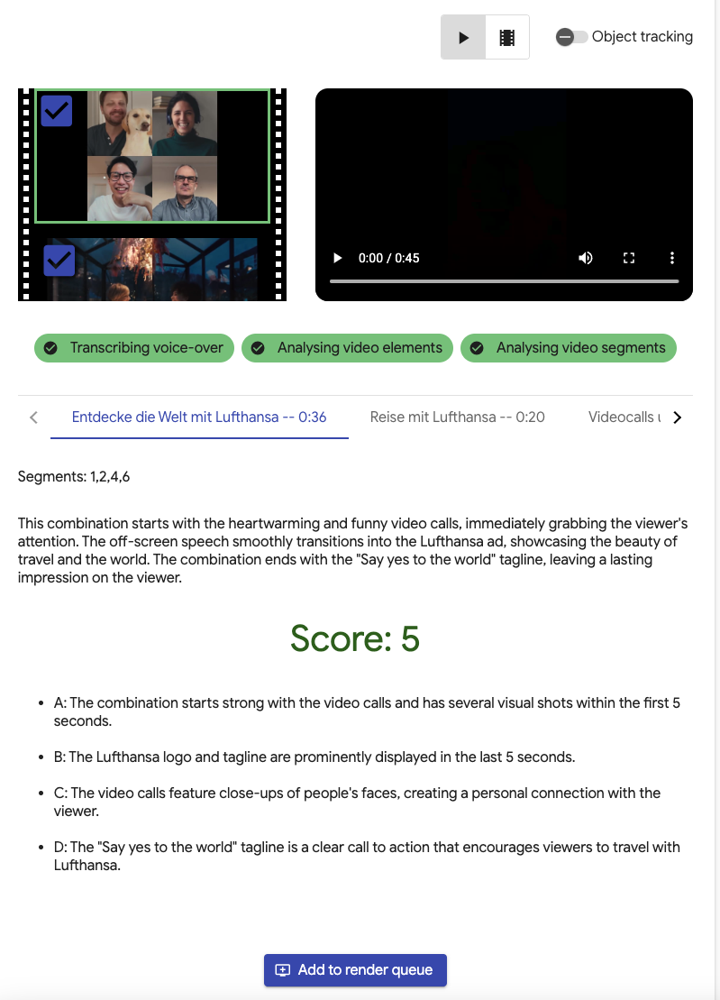

   

  Each variant has the following information:
  * A title which is displayed in the variant's tab.
  * A duration, which is also displayed in the variant's tab.
  * The total duration is also displayed below the segments list, so that users can preview the variant's duration as they select/deselect segments.
  * The list of A/V segments that make up the variant.
  * A description of the variant and what is happening in it.
  * An LLM-generated Score, from 1-5, representing how well the variant adheres to the input rules and guidelines. Users are strongly encouraged to update this section of the generation prompt in [config.ts](ui/src/config.ts) to refer to their own brand voice and creative guidelines.
  * Reasoning for the provided score, with examples of adherence / inadherence.

  Variants are sorted in descending order, first by the proximity of their duration to the user's target duration, and then by score for variants with the same duration.

#### 4.2. User Controls for Video Rendering

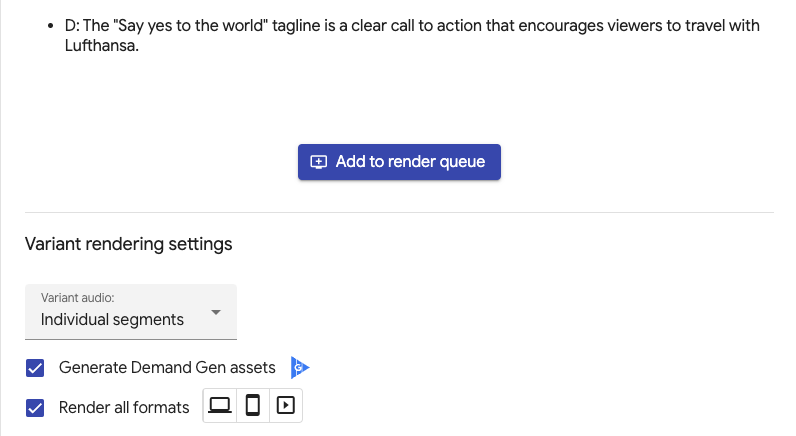

* Vigenair supports different rendering settings for the audio of the generated videos. The image below describes the supported options and how they differ:

  
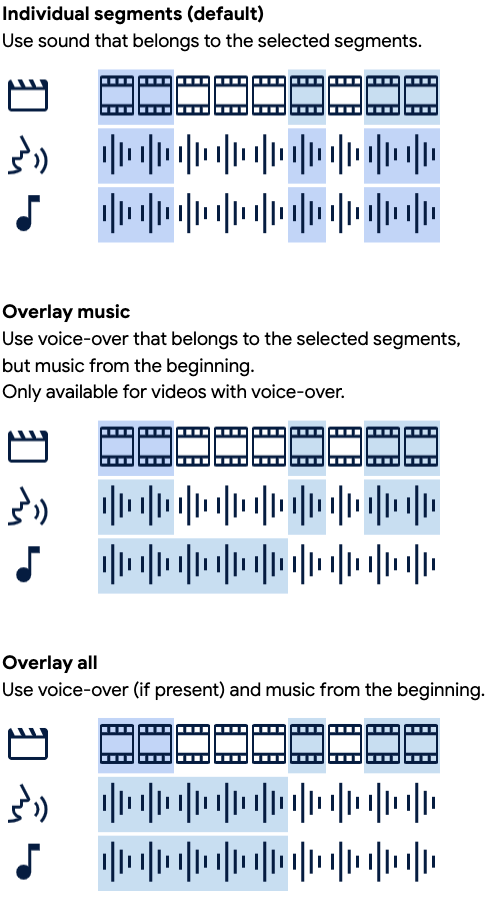

  Furthermore, if *Music* or *All audio* overlay is selected, the user can additionally decide how the overlay should be done via one of the following options:

  
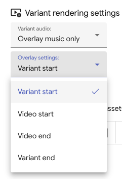

  * **Variant start** (default): Audio will start from the beginning of the first segment in the variant.
  * **Video start**: Audio will start from the beginning of the original video, regardless of when the variant starts.
  * **Video end**: Audio will end with the ending of the original video, regardless of when the variant ends.
  * **Variant end**: Audio will end with the ending of the last segment in the variant.

* Whether to fade out audio at the end of generated videos. When selected, videos will be faded out for `1s` (configured by the `CONFIG_DEFAULT_FADE_OUT_DURATION` environment variable for the Combiner service).
* Whether to generate [Demand Gen](https://support.google.com/google-ads/answer/13695777) campaign text and image assets alongside the variant or not.
* Which formats (horizontal, vertical and square) assets to render. Defaults to rendering horizontal assets only.
* Users can also select the individual segments that each variant is comprised of. This selection is available in both the *video preview* and *segments list* views. Please note that switching between variant tabs will clear any changes to the selection.
* Users may also change the order of segments via the *Reorder segments* toggle, allowing the preview and rendering of more advanced and customised variations. Please note that reodering segments will reset the variant playback, and switching the toggle *off* will restore the original order.

  

#### 4.3. Loading Previously Rendered Videos

Users may also choose to skip the variants generation and rendering process and directly display previously rendered videos using the "Load rendered videos" dropdown.

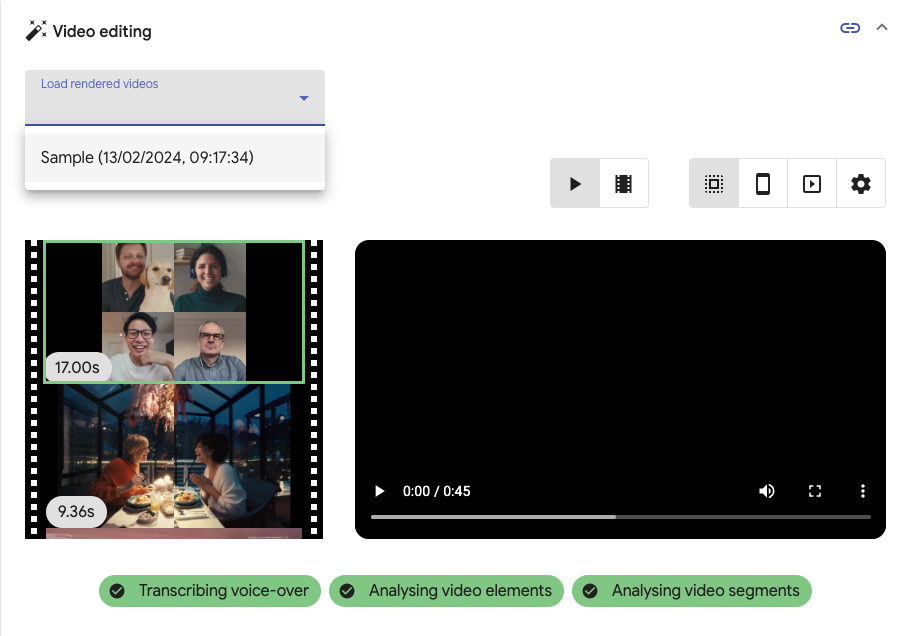

The values displayed in the dropdown represent the optional custom name that the user may have provided when building their render queue (see [Rendering](#5-rendering)), along with the date and time of rendering (which is added automatically, so users don't need to manually input this information).

#### 4.4. Render Queue

Desired variants can be added to the render queue along with the their associated render settings:

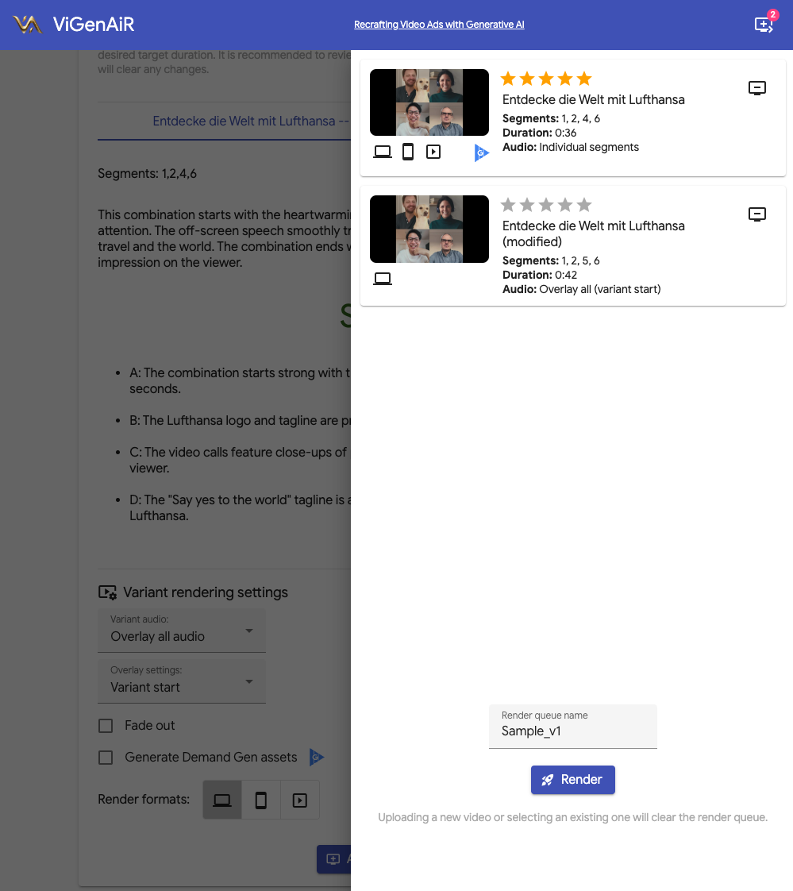

* Each variant added to the render queue will be presented as a card in a sidebar that will open from the right-hand-side of the page. The card contains the thumbnail of the variant's first segment, along with the variant title, list of segments contained within it, its duration and chosen render settings (audio settings including fade out, Demand Gen assets choice and desired formats).
* Variants where the user had manually modified the preselected segments will be displayed with the score greyed out and with the suffix `(modified)` appended to the variant's title.
* Users cannot add the same variant with the *exact same segment selection and rendering settings* more than once to the render queue.
* Users can always remove variants from the render queue which they no longer desire via the dedicated button per card.
* Clicking on a variant in the render queue will *load* its settings into the *video preview* and *segments list* views, allowing users to preview the variant once more.

#### 5. Rendering

Clicking on the `Render` button inside the render queue will render the variants in their desired formats and settings via the Combiner service Cloud Function (writing `render.json` to GCS, which serves as the input to the service, and the output is a `combos.json` file. Both files, along with the *rendered* variants, are stored in a `<timestamp>-combos` subfolder below the root video folder). Users may also optionally specify a name for the render queue, which will be displayed in the "Load rendered videos" dropdown (see [Loading Previosuly Rendered Videos](#43-loading-previously-rendered-videos)).

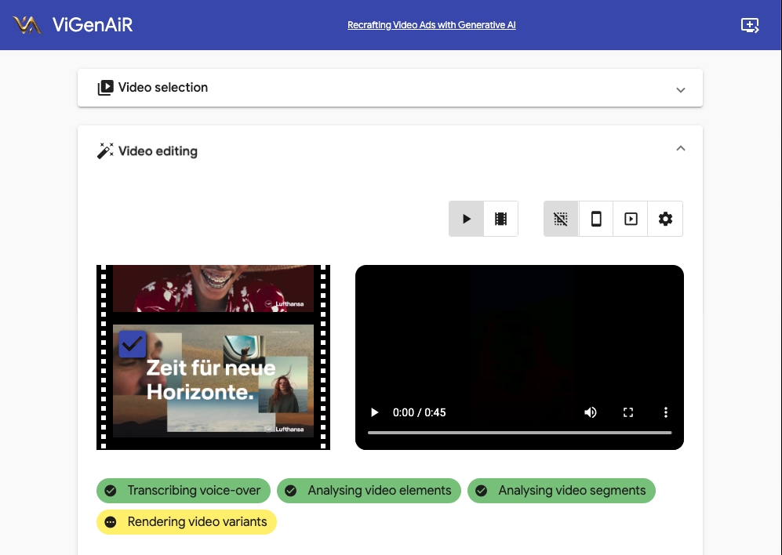

#### 6. Output Videos

The UI continuously queries GCS for updates. Once a `combos.json` is available, the final videos - in their different formats and along with all associated assets - will be displayed. Users can preview the final videos and select the ones they would like to upload into Google Ads / YouTube. Users may also share a page of the Web App containing the rendered videos and associated image & text assets via the dedicated "share" icon in the top-right corner of the "Rendered videos" panel. Finally, users may also regenerate Demand Gen text assets, either in bulk or individually, using the auto-detected language of the video or by specifying a desired target language.

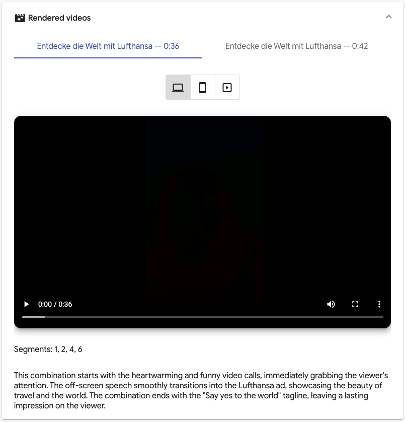

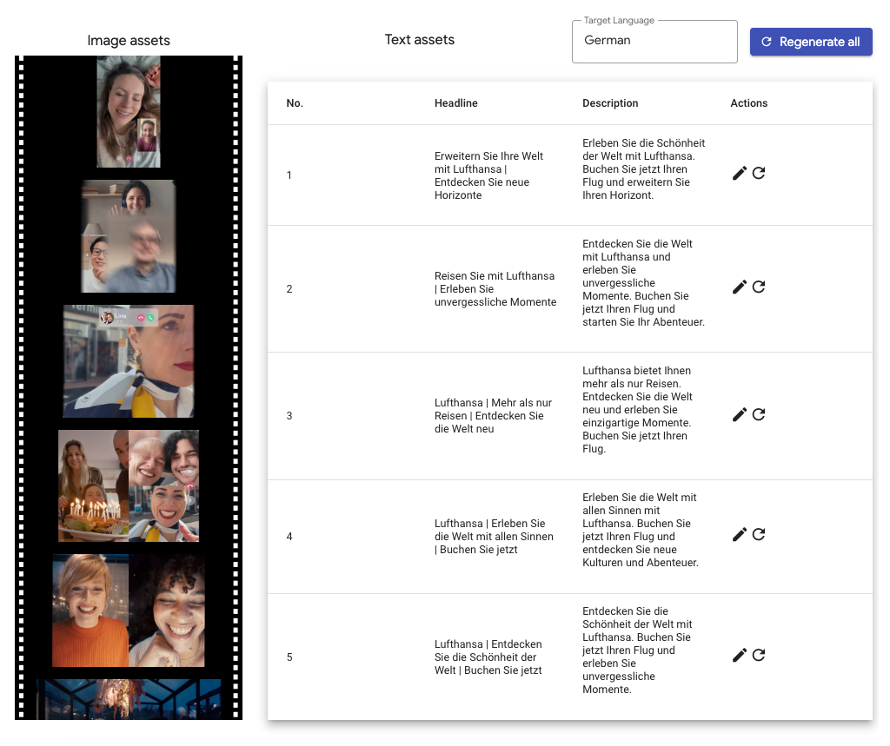

> Note: Due to an [ongoing Apps Script issue](https://issuetracker.google.com/issues/170799249), users viewing the application via "share" links **must** be granted the `Editor` role on the underlying Apps Script project. This can be done by navigating to the [Apps Script home page](https://script.google.com), locating the `ViGenAiR` script and using the [more vertical](https://fonts.google.com/icons?selected=Material+Symbols+Outlined:more_vert) to `Share`.

### Pricing and Quotas

Users are priced according to their usage of Google (Cloud and Workspace) services as detailed below. In summary, Processing *1 min of video and generating 5 variants* would cost around **$2 to $6** based on your Cloud Functions configuration. You may modify the multimodal and language models used by Vigenair by modifying the `CONFIG_VISION_MODEL` and `CONFIG_TEXT_MODEL` environment variables respectively for the Cloud Function in [deploy.sh](./service/deploy.sh), as well as the `CONFIG.vertexAi.model` property in [config.ts](ui/src/config.ts) for the frontend web app. The most cost-effective setup is using `Gemini 1.5 Flash` (default), for both multimodal and text-only use cases, also considering [quota limits](https://cloud.google.com/vertex-ai/generative-ai/docs/quotas#quotas_by_region_and_model) per model.

For more information, refer to this detailed [Cloud pricing calculator](https://cloud.google.com/products/calculator/?dl=CiQzNTJkZmI0Yy05NjAzLTRlNjYtOWJkNy05ZjhiOTgxODE0MWUQBBokRkU5NkJFQzItNTE3OS00NDA5LTgwOUItQ0JFOTI3NDdEMjFB) example using `Gemini 1.5 Flash`. The breakdown of the charges are:

* Apps Script (where the UI is hosted): **Free of charge**. Apps Script services have [daily quotas](https://developers.google.com/apps-script/guides/services/quotas) and the one for *URL Fetch calls* is relevant for Vigenair. Assuming a rule of thumb of *100 URL Fetch* calls per video, you would be able to process **200 videos per day** as a standard user, and **1000 videos per day** as a Workspace user.
* Cloud Storage: The storage of input and generated videos, along with intermediate media files (voice-over, background music, segment thumbnails, different JSON files for the UI, etc.). Pricing varies depending on region and duration, and you can assume a rule of thumb of **100MB per 1 min of video**, which would fall within the Cloud **free** tier. Refer to the full [pricing guide](https://cloud.google.com/storage/pricing) for more information.
* Cloud Functions (which includes Cloud Build, Eventarc and Aritfact Registry): The processing, or *up*, time only; idle-time won't be billed, unless [minimum instances](https://cloud.google.com/functions/docs/configuring/min-instances) are configured. Weigh the impact of [cold starts](https://cloud.google.com/functions/docs/concepts/execution-environment#cold-starts) vs. potential cost and decide whether to set `min-instances=1` in [deploy.sh](./service/deploy.sh) accordingly. Vigenair's cloud function is triggered for *any* file upload into the GCS bucket, and so you can assume a threshold of **max 100 invocations and 5 min of processing time per 1 min of video**, which would cost around **$1.3** with `8 GiB (2 vCPU)`, **$2.6** with `16 GiB (4 vCPU)`, and **$5.3** with `32 GiB (8 vCPU)`. Refer to the full [pricing guide](https://cloud.google.com/functions/pricing) for more information.
* Vertex AI generative models:
  * Text: The language model is queried with the entire [generation prompt](ui/src/config.ts), which includes a script of the video covering all its segments and potentially a user-defined section. The output is a list containing one or more variants with all their information. This process is repeated in case of errors, and users can generate variants as often as they want. Assuming an average of **15 requests per video** - continuing with the assumption that the video is 1 min long - you would be charged around **$0.5**.
  * Multimodal: The multimodal model is used to annotate every segment extracted from the video, and so the pricing varies significantly depending on the number and length of the extracted segments, which in turn vary heavily according to the content of the video; a 1 min video may produce 10 segments while another may produce 20. Assuming a threshold of **max 25 segments, avg. 2.5s each, per 1 min of video**, you would be charged around **$0.2**.

## How to Contribute

Beyond the information outlined in our [Contributing Guide](CONTRIBUTING.md), you would need to follow these additional steps to build Vigenair locally and modify the source code:

### Build and Deploy GCP Components

1. Make sure your system has an up-to-date installation of the [gcloud CLI](https://cloud.google.com/sdk/docs/install).
1. Run `gcloud auth login` and complete the authentication flow.
1. Navigate to the directory where the source code lives and run `cd service`
1. Run `bash deploy.sh`.

### Build and Serve the Angular UI

1. Make sure your system has an up-to-date installation of [Node.js and npm](https://docs.npmjs.com/downloading-and-installing-node-js-and-npm).
1. Install [clasp](https://github.com/google/clasp) by running `npm install @google/clasp@2.4.2 -g`, then login via `clasp login`.
1. Navigate to the [Apps Script Settings page](https://script.google.com/home/usersettings) and `enable` the Apps Script API.
1. Navigate to the directory where the source code lives and run `cd ui`
1. Run `npm install` to install dependencies.
1. Run `npm run deploy` to build, test and deploy (via [clasp](https://github.com/google/clasp)) all UI and Apps Script code to the target Apps Script project.
1. Navigate to the directory where the Angular UI lives: `cd src/ui`
1. Run `ng serve` to launch the Angular UI locally with Hot Module Replacement (HMR) during development.
